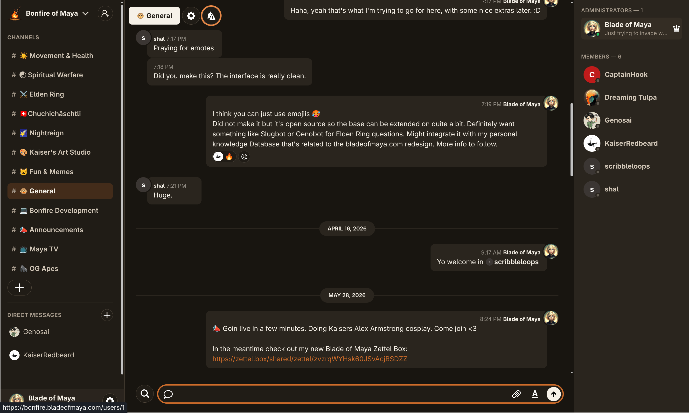

<p align="center">
  
</p>

# Bonfire

> [!IMPORTANT]
> Bonfire is in active development and is not feature complete yet. It is
> already usable, but you should expect rough edges and changes along the way.


Bonfire is a self-hosted, Discord-like chat for communities. It is a place for
announcements, conversations, rich media, custom emotes, notifications, and
updates from streams, videos, and community bots. It's based on [once-campfire](https://github.com/basecamp/once-campfire) by 37signals.

The idea is simple: instead of putting your community in the hands of a large
platform, you run Bonfire on your own server. Streamers and other community
builders can stay close to their people, keep conversations private, and decide
for themselves how their space should work.

Our goal is to make that as easy as possible—including a one-click path from a
fresh server to a running community. Every Bonfire belongs to the people who
run it: you own the data, choose the rules, and shape the experience.




## What works today

- Public and private rooms
- Direct messages
- File uploads with previews
- Search
- Web Push notifications and @mentions
- Bot accounts and an API for posting messages
- A responsive web app that can be installed on your phone or desktop
- A self-contained setup that can run on a single server

## Where Bonfire is going

The roadmap is focused on the things that help an independent community feel
at home:

- **Clearer community spaces:** a data-protection notice during signup and
  read-only rooms for announcements.
- **Keeping people connected:** email notifications for missed mentions and
  better ways to sort, pin, and organize channels.
- **Better links and media:** useful YouTube previews and a built-in GIF picker
  that respects the community's privacy choices.
- **Streams, videos, and bots:** safe integrations that can announce when a
  streamer goes live, a new video is published, or a community bot has news.
- **A space with its own personality:** custom emotes with shortcodes,
  autocomplete, and an easy picker for desktop and mobile.
- **A dependable home:** better accessibility, backups, moderation safeguards,
  rate limits, and tools that make problems easier to spot and fix.

These features will arrive one piece at a time. Items on this list are plans,
not promises that they are already part of the current release.

## Running your own Bonfire

Bonfire is made to live on one Linux server. The app, background work, caching,
file serving, and HTTPS are packaged together, while your conversations and
uploads stay in one persistent storage folder.

### The guided setup

The included setup command asks a few questions, creates the secrets Bonfire
needs, checks the server, and shows you what it is about to do before making
changes:

```sh
bin/bonfire setup
```

Once Bonfire is running, these commands let you check on it and publish a new
version:

```sh
bin/bonfire status
bin/bonfire deploy
bin/bonfire console
bin/bonfire kamal details
```

`bin/bonfire kamal …` runs any Kamal subcommand with the private deployment
configuration loaded. Kamal loads `.kamal/secrets` itself; Bonfire never
evaluates, captures, or prints secret values. Commands that directly inspect
secrets or execute arbitrary code are intentionally unavailable through this
LLM-safe wrapper.

To move an existing installation, lower the public hostname's DNS TTL first,
then run the migration with the new SSH destination:

```sh
bin/bonfire migrate root@203.0.113.10 --dry-run
bin/bonfire migrate root@203.0.113.10
```

The command stops the old application before copying its database and uploads,
deploys and checks the new server, then pauses for the DNS change. See the
[server migration guide](docs/self-hosting.md#migrating-to-another-server) for
the cutover and rollback details.

You can see every available option with `bin/bonfire help`. The private setup
files live under `.kamal/` and are not committed to Git. Keep a secure backup
of the generated secrets.

Private-room RTMP Homebrew playback configuration and its production smoke
checklist are documented in [docs/streaming.md](docs/streaming.md).

### Using Docker yourself

If you already have your own way of running containers, you can use
`ghcr.io/bladeofmaya/bonfire:latest` or build the image from this repository.
The [self-hosting guide](docs/self-hosting.md) covers storage, HTTPS, backups,
restores, and updates.

> [!TIP]
> The first time Bonfire starts, it walks you through creating an administrator
> account. The administrator's email address is shown on the sign-in page so
> community members know whom to ask for help.

## Working on Bonfire locally

Prepare the app with:

```sh
bin/setup
```

Then start it with:

```sh
bin/dev
```

Open [http://bonfire.localhost:3021](http://bonfire.localhost:3021) and follow
the first-run setup. You do not need to set up Postgres or MinIO; Bonfire uses
SQLite and local file storage during development.

To wipe your local data and start fresh:

```sh
bin/dev reset
```

The [development guide](docs/development.md) has the rest, including testing
notifications and running the test suite.

## Contributing

Bonfire is meant to grow around real communities. Bug fixes, thoughtful ideas,
and improvements are welcome. Try to keep each change focused, tested, and easy
for another person to understand or undo.

Bonfire also keeps track of changes from the project it grew out of, so useful
upstream fixes can continue to find their way here.

## Security

Found something that could put a community at risk? Please follow the private
reporting instructions in [SECURITY.md](SECURITY.md).
